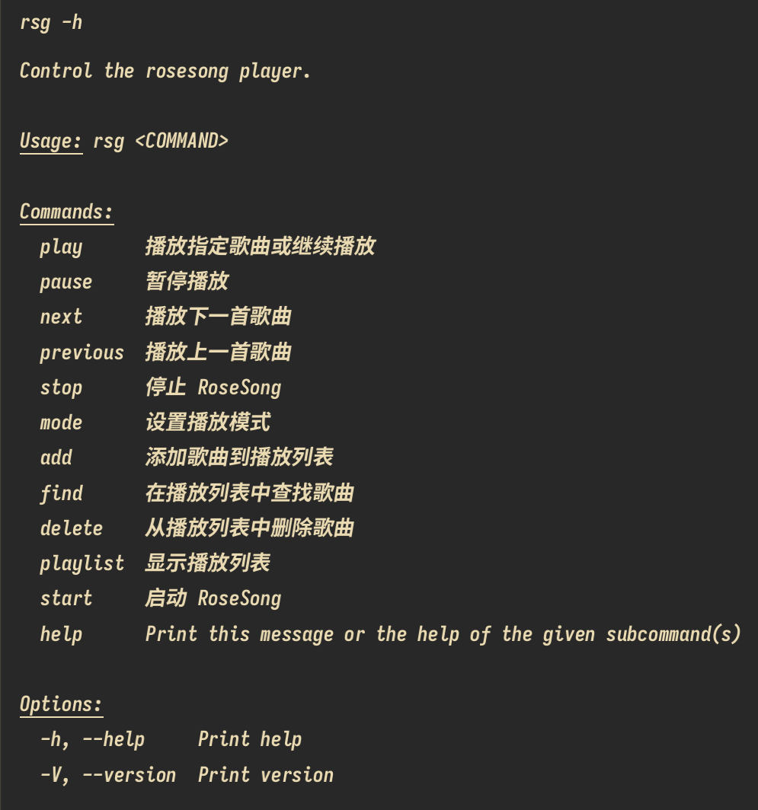
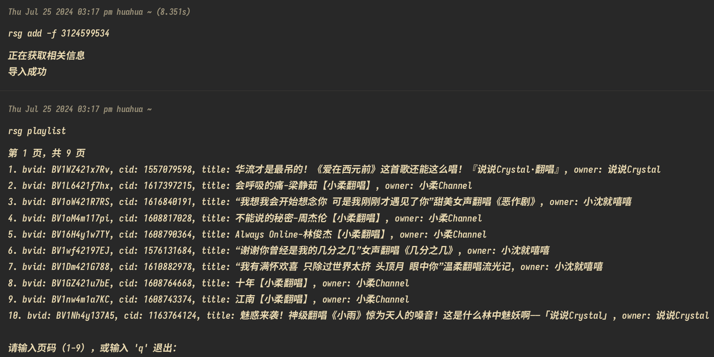
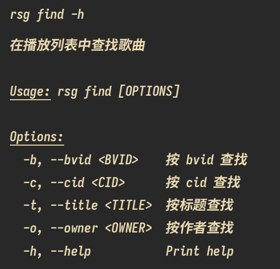

<p align="center">
    
</p>
<h1 align="center">RoseSong</h1>

# 简介
由rust构建的基于GStreamer解码播放bilibili音频的命令行播放器，使用dbus进行进程间通信，可以快速导入b站收藏夹（目标收藏夹需要在导入的时候处于公开状态）

# 安装说明
  - 如果安装遇到网络问题可以使用[gitee](https://gitee.com/huahuadeliaoliao/RoseSong)

## Linux

### Debian/Ubuntu
  - 可直接下载[release](https://github.com/huahuadeliaoliao/RoseSong/releases)页面中提供的deb进行安装

### Other
  - RoseSong程序依赖GStreamer和dbus，大部分linux系统都自带了的，如果程序无法正常运行需要检查这两个依赖项
  - 使用以下命令安装 RoseSong，这会将rosesong和rsg二进制可执行文件（仅支持linux amd64）放入到当前用户的.local/bin目录当中：
```bash
curl -s https://raw.githubusercontent.com/huahuadeliaoliao/RoseSong/main/installation_script/install_rosesong.sh | bash
```
## MacOS
  - 暂不支持

## Windows
  - 暂不支持


# 版本历史
## 正式版 1.0.0
- [版本信息](https://github.com/huahuadeliaoliao/RoseSong/releases/tag/v1.0.0)
- **使用示例**
  - 使用 rsg -h 获取使用说明：

    
  - 使用rsg add -f fid 通过fid导入收藏夹（fid就是b站收藏夹网址中fid之后的数字，导入收藏夹需要稍微等待一段时间）：

    
  - 使用rsg add -b bvid 通过bvid导入歌曲（bvid就是b站视频网址中的BV开头的字符串）：
  
    
  - 使用rsg delete 删除导入的歌曲：
  
    
  - 使用rsg find 查找导入歌曲的信息：
  
    
